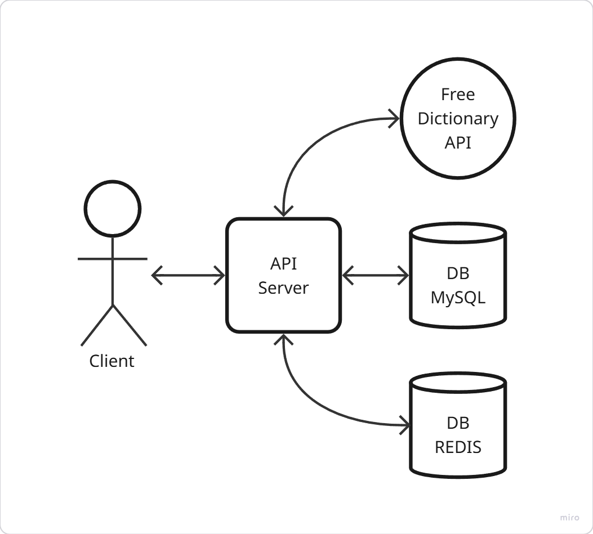
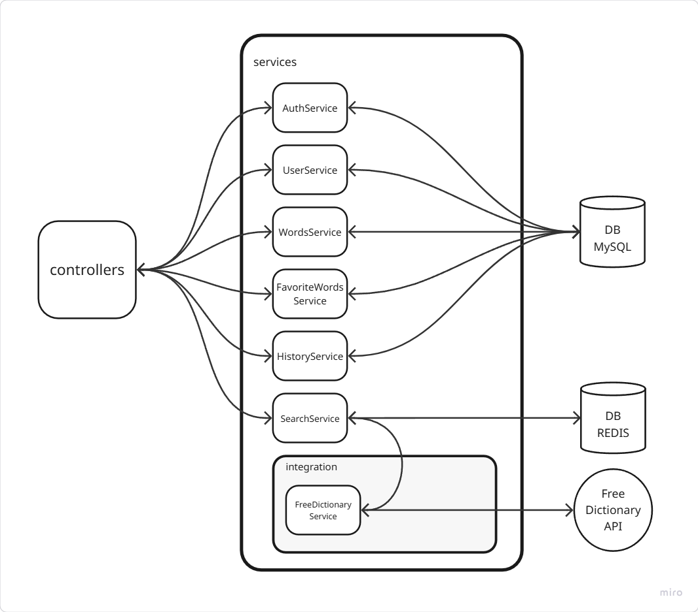
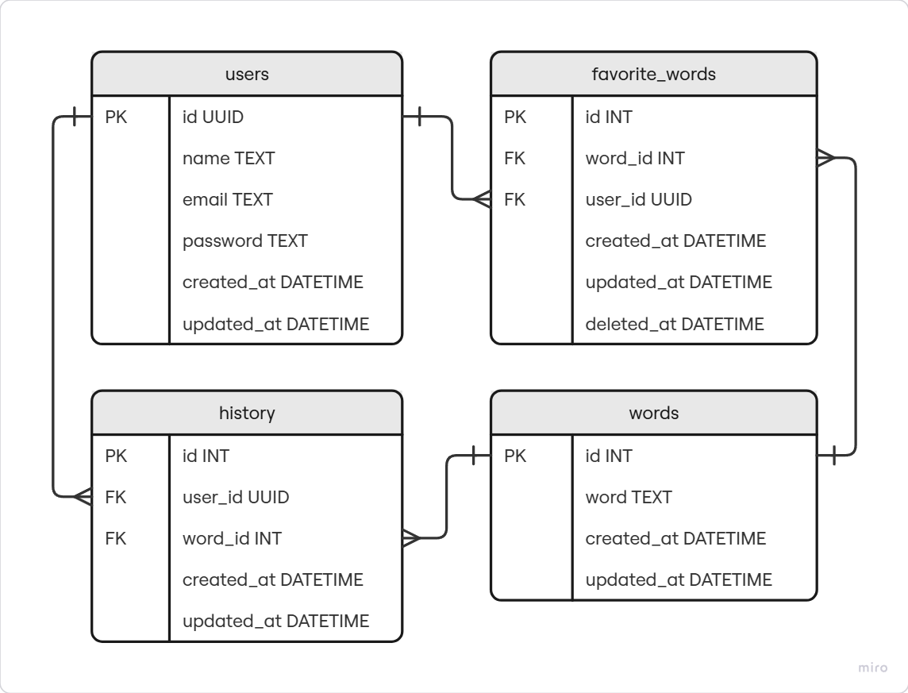

# 📄 Dictionary API

## 📌 Sumário

1. [Visão Geral](#-visao-geral)
2. [Tecnologias Utilizadas](#-tecnologias-utilizadas)
3. [Funcionalidades](#-funcionalidades)
4. [Arquitetura](#-arquitetura)
5. [Extras Técnicos](#-extras-tecnicos)
6. [Instalação e Setup](#-instalacao-e-setup)
7. [Coleção Postman](#-colecao-postman)
8. [Documentação da API (Swagger)](#-documentação-da-api-swagger)
9. [Melhorias Futuras](#-melhorias-futuras)

---

## 📘 Visão Geral

O sistema tem como objetivo funcionar como um dicionário digital, permitindo que o usuário pesquise significados de palavras, salve favoritas, acompanhe seu histórico de buscas e gerencie seu acesso por meio de autenticação de usuários.

---

## 🛠 Tecnologias Utilizadas 

- **Backend:** Laravel 12 (PHP 8.2)
- **Banco de Dados:** MySQL
- **Cache**: Redis
- **API:** RESTful
- **Autenticação:** JWT Token
- **Ambiente:** Docker

---

## 🏧 Arquitetura

- O sistema é desenvolvido utilizando a arquitetura MVC do Laravel, com a lógica de negócio centralizada em **services** , promovendo uma melhor separação de responsabilidades e facilitando a manutenção e escalabilidade da aplicação.

### 📌 Visão Geral da Arquitetura

Estrutura macro do sistema, com os principais módulos e sua interação.

<p align="center">
  
</p>

### 🔍 Arquitetura Detalhada

Organização interna das camadas, incluindo Controllers, Services, Integrações e Databases.

<p align="center">
  
</p>

### 🗄️ Diagrama do Banco de Dados

Modelo do banco de dados e suas relações.

<p align="center">
  
</p>

---

## 🧩 Extras Técnicos

- **Middleware de Autenticação**: Criado middleware personalizado para validar token JWT em rotas protegidas.
- **Middleware CacheInfo**: Criado middleware personalizado para retornar headers que sinalizam o tempo de execução da requisição e se a informação é retornada estava armazenada em cache.
- **Service Layer**: Toda a lógica de negócio alocada nos services para manter os controllers enxutos.
- **Comando Artisan Personalizado**: Para importar as palavras para banco de dados através de um arquivo .json (`php artisan app:import-words`).
- **Histórico de busca**: Ao buscar uma palavra, o sistema dispara um evento que aciona um listener responsável por salvar a busca no histórico do usuário. Esse padrão desacopla a responsabilidade da camada de controller, mantendo a arquitetura limpa e escalável.

---

## 🚀 Instalação e Setup

- Faça o clone do repositório.
- Certifique-se de que o Docker e o Docker Compose estão instalados.
- Faça um cópia do arquivo (`.env.example`):
  ```bash
  cp .env.example .env
  ```
- Edite o arquivo (`.env`) para configurar as variáveis do seu ambiente.
  ```bash
  DB_CONNECTION=mysql
  DB_HOST=adicione o seu host do banco de dados aqui
  DB_PORT=3306
  DB_DATABASE=adicione o nome do seu banco de dados aqui
  DB_USERNAME=adicione o seu nome de usuário do banco de dados aqui
  DB_PASSWORD=adicione a sua senha do banco de dados aqui
  REDIS_CLIENT=phpredis
  REDIS_HOST=adicione o seu host do Redis aqui
  REDIS_PASSWORD=adicione a sua senha do Redis aqui
  REDIS_PORT=6379
  JWT_SECRET=adicione o seu JWT_SECRET aqui (base64)
  ```
- Faça o build do projeto:
  ```bash
  docker-compose build
  ```
- Execute o projeto:
  ```bash
  docker-compose up -d
  ```
- Execute as migrations para criar as tabelas:
  ````bash
  docker-compose exec app php artisan migrate
  ````
- Faça a importação das palavras:
  ```bash
  docker-compose exec app php artisan app:import-words
  ```

---

## 🗋 Documentação da API (Swagger)

> Documentação interativa criada com pacote [L5 Swagger](https://github.com/DarkaOnLine/L5-Swagger)

Acessível via:

```
http://localhost:8000/api/documentation
```

---

## 📬 Coleção Postman

Para facilitar os testes da API, baixe a coleção e importe no [Postman](https://www.postman.com/):

🧾 [Download da coleção](docs/collection.json)

---

## 🔮 Melhorias Futuras

- Implementar paginação com cursores.
- Adicionar testes automatizados (PHPUnit).
- Internacionalização para suporte a múltiplos idiomas.
- Fila para eventos assíncronos (como histórico de busca).

---

> This is a challenge by [Coodesh](https://coodesh.com/)
